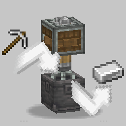
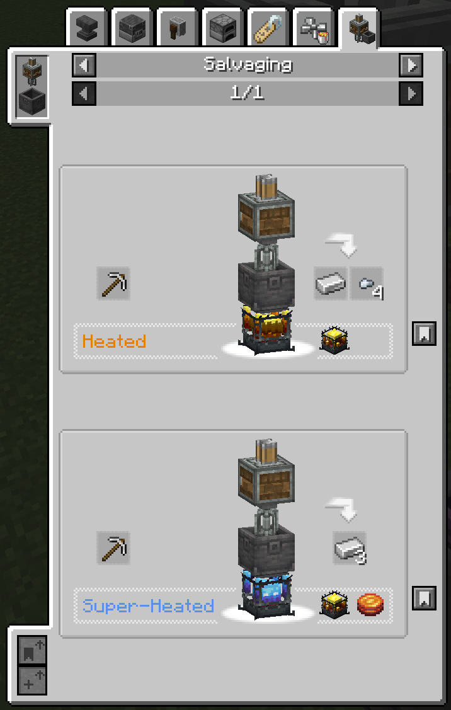

## Create: Salvage

Finally, a use for all those excess tools and armor pieces!

Create: Salvage provides a new category of recipes, allowing you to salvage raw materials from unwanted tools.

## Features

- Place a Mixer above a Basin and a Blaze Burner below, then add your unwanted items. When complete, you will receive Ingots and Nuggets equal to half the crafting cost of the item. Damaged tools salvage into proportionally less raw material.
- Superheat the Blaze Burner to increase the salvage rate to 100% for metal items, and enable salvaging higher tier items like Diamond and Netherite.
- A custom Ponder scene explaining the mod.
- A custom JEI recipe category to view all applicable recipes.
- Fully data-driven recipes for ease of modding and modpack development.
- Built-in recipes automatically applying recipes for a bunch of mods.
- A Diamond Nugget because I felt Diamond Shovels giving nothing was a feelsbad. Use [Almost Unified](https://modrinth.com/mod/almost-unified) if this conflicts with another mod.

## Built-In Recipes

The following mods have built-in recipes:

- [Create](https://modrinth.com/mod/create)
- [The Aether](https://modrinth.com/mod/aether)
- [Farmer's Delight](https://modrinth.com/mod/farmers-delight)
- [Deep Aether](https://modrinth.com/mod/deep-aether)
- [Aether's Delight](https://modrinth.com/mod/the-aethers-delight)
- [Leaf's Copper Backport](https://modrinth.com/mod/copper-backport/)

## Contribute
Feel free to open a PR to either translate the mod or to add another feature! All help is appreciated!

### If you want to help us to translate...
Please find the English language file in `src/main/resources/assets/create_salvage/lang`, and create a new JSON with the translated values.

## Download
 
